# JesManage — Architecture

This document describes JesManage's actual, current implementation: a MERN-stack,
multi-tenant school management platform built for Ghanaian basic schools
(NaCCA grading). It is generated from the real codebase — model schemas, route
tables, and middleware — not from a design proposal, and it is verified by the
automated test suite (`server/tests`, 37/37 passing: authentication,
multi-tenancy, role authorization, the results state machine, parent/student
isolation, and offline sync conflict handling).

**Stack**: React (Vite) + React Router · Express.js · MongoDB/Mongoose ·
JWT authentication · `AsyncLocalStorage`-based multi-tenancy · Puppeteer
(PDF generation) · Jest/Supertest (testing).

---

## 1. System Architecture

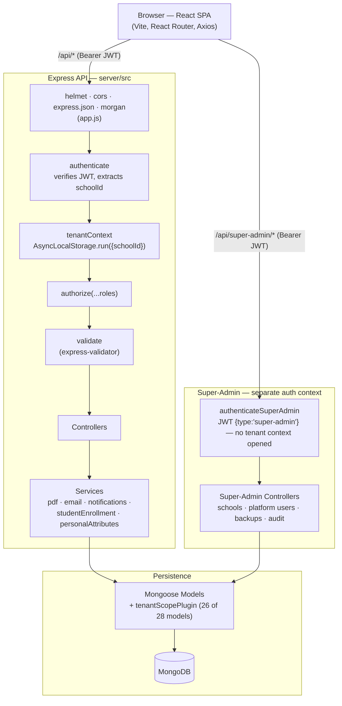

Every tenant-facing request passes through the same five-stage middleware
chain in the same order; there is no per-route bypass. Super-Admin requests
are handled by an entirely separate authentication middleware
(`authenticateSuperAdmin.js`) that deliberately never opens tenant context —
`School` is the tenant registry itself and cannot be scoped to a tenant.

---

## 2. Multi-Tenant Architecture

Tenancy is enforced at the **query layer**, not just the controller layer: a
Mongoose plugin (`src/plugins/tenantScope.js`) is attached to every
tenant-owned model and throws rather than silently returning unscoped data if
no tenant context is present.

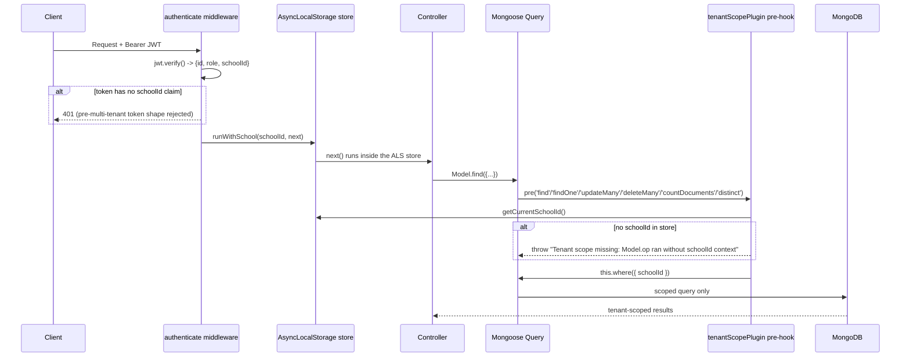

**Scoping rules, verified from `src/models/*.js`:**
- 26 of 28 models carry `schoolId` and are wrapped by `tenantScopePlugin`.
  `School` (the tenant registry) and `PlatformSettings` (a global singleton)
  are the only exceptions — deliberately unscoped.
- On `save`, a new document with no `schoolId` is auto-stamped from the ALS
  context (`stampSchoolIdOnSave`); an explicit `schoolId` in the payload is
  never trusted over the authenticated tenant's own context, which is how a
  client-supplied `schoolId` spoof attempt is neutralized (covered by
  `tests/tenancy.test.js`).
- A query built with an explicit `{ schoolId }` filter already present is
  passed through unmodified — scoping only fires when the filter is silent
  on `schoolId`.

**Known pitfall (documented from a real bug caught during test-writing):**
Mongoose queries (`find`/`findOne`/etc.) are lazy — calling
`Model.findOne(...)` only *builds* the query; it doesn't execute until
`.then()`/`await` runs. `runWithSchool(id, () => Model.findOne(...))` loses
ALS context, because the query's `.then()` fires outside the synchronous
`als.run()` frame. The fix is always an `async` callback:
`runWithSchool(id, async () => Model.findOne(...))`. `Model.create()` isn't
affected — it starts executing immediately, so the ALS context propagates
through its internal promise chain correctly either way.

---

## 3. Entity-Relationship Diagrams

Split into five domains for readability — all 28 models, drawn from their
actual `ref` fields (see `src/models/*.js`). Every entity below also carries
a `schoolId → School` foreign key unless noted; that edge is omitted from
each diagram to avoid drawing "SCHOOL has everything" 28 times.

### 3.1 Identity & Tenancy

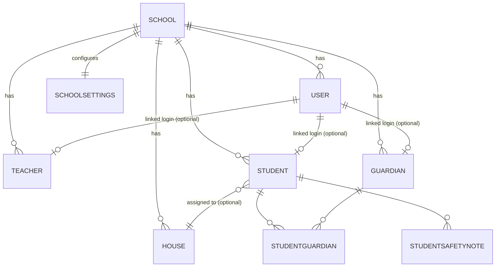

`StudentGuardian` is the pure join table resolving the Student↔Guardian
many-to-many (a student can have multiple guardians; a guardian can have
multiple children), unique on `{schoolId, studentId, guardianId}`.
`User.role` ∈ `{admin, teacher, student, parent}` is the single account
table behind every login; `Teacher`/`Student`/`Guardian` are the
role-specific profile records it optionally links to.

### 3.2 Academic Structure

```mermaid
erDiagram
    SCHOOL ||--o{ CLASS : has
    SCHOOL ||--o{ SUBJECT : has
    SCHOOL ||--o{ ACADEMICTERM : has
    SCHOOL ||--|| GRADINGSCHEME : "one scheme"
    SCHOOL ||--o{ PERSONALATTRIBUTE : defines
    CLASS }o--o| TEACHER : "class teacher (optional)"
    STUDENT }o--|| CLASS : "enrolled in"
    CLASS ||--o{ CLASSSUBJECT : offers
    SUBJECT ||--o{ CLASSSUBJECT : "offered via"
    ACADEMICTERM ||--o{ CLASSSUBJECT : ""
    TEACHER ||--o{ TEACHERSUBJECTASSIGNMENT : teaches
    CLASS ||--o{ TEACHERSUBJECTASSIGNMENT : ""
    SUBJECT ||--o{ TEACHERSUBJECTASSIGNMENT : ""
    ACADEMICTERM ||--o{ TEACHERSUBJECTASSIGNMENT : ""
```

`ClassSubject` (which subjects a class offers, per term) and
`TeacherSubjectAssignment` (which teacher covers which class+subject, per
term) are the two join tables that `assertClassAccess` checks before letting
a teacher touch a result sheet — this is the actual authorization boundary
behind "teacher cannot record scores for an unassigned class."
`GradingScheme` is a one-per-school singleton (`{schoolId}` unique) holding
`classScoreMax`/`examScoreMax`/grade `bands`.

### 3.3 Results & Reporting Lifecycle

```mermaid
erDiagram
    STUDENT ||--o{ RESULT : ""
    SUBJECT ||--o{ RESULT : ""
    CLASS ||--o{ RESULT : ""
    ACADEMICTERM ||--o{ RESULT : ""
    TEACHER ||--o{ RESULT : "recorded by"
    CLASS ||--o{ RESULTSHEET : ""
    SUBJECT ||--o{ RESULTSHEET : ""
    ACADEMICTERM ||--o{ RESULTSHEET : ""
    TEACHER ||--o{ RESULTSHEET : submits
    USER ||--o{ RESULTSHEET : reviews
    STUDENT ||--o{ TERMINALREPORT : ""
    CLASS ||--o{ TERMINALREPORT : ""
    ACADEMICTERM ||--o{ TERMINALREPORT : ""
    USER ||--o{ TERMINALREPORT : reviews
    PERSONALATTRIBUTE ||--o{ TERMINALREPORT : "rated (embedded array)"
```

Two independent state machines govern this domain — this is the part of
JesManage the automated test suite (`results.test.js`, `offline.test.js`)
exercises most heavily:

- **`ResultSheet.status`** (one per class+subject+term):
  `Draft → Submitted → Approved`, with `Submitted → Rejected → Draft` as the
  correction loop. A `Result` write (`POST /results/bulk`) is rejected with
  `400 RESULT_LOCKED` once the sheet is `Submitted` or `Approved` — this is
  the exact check that also rejects a replayed offline queue entry.
- **`TerminalReport.status`** (one per student+term):
  `Draft → Submitted → Locked → Published`, with `→ Rejected` as a
  correction branch. `Locked` freezes every `Result` belonging to that
  student for that term, independent of that subject's own `ResultSheet`
  status — a second, student-scoped lock on top of the subject-scoped one.

### 3.4 Finance

```mermaid
erDiagram
    SCHOOL ||--o{ FEESTRUCTURE : defines
    STUDENT ||--o{ FEE : owes
    ACADEMICTERM ||--o{ FEE : ""
    FEESTRUCTURE ||--o{ FEE : generates
    FEE ||--o{ PAYMENT : "paid via"
    USER ||--o{ PAYMENT : receives
    STUDENT ||--o{ FEEDINGCHARGE : ""
    CLASS ||--o{ FEEDINGCHARGE : ""
    FEE ||--o{ FEEDINGCHARGE : "rolls into"
    USER ||--o{ FEEDINGCHARGE : records
```

`Fee.status` ∈ `{Pending, Partial, Paid}`, derived from the sum of its
`Payment` records. `FeedingCharge` is a daily per-student charge that gets
folded into a `Fee` of category `Feeding` rather than billed separately.

### 3.5 Admissions, Communication & Ops

```mermaid
erDiagram
    SCHOOL ||--o{ ADMISSION : receives
    CLASS ||--o{ ADMISSION : "desired class"
    USER ||--o{ ADMISSION : reviews
    ADMISSION ||--o| STUDENT : "enrolls into (on approval)"
    SCHOOL ||--o{ ANNOUNCEMENT : sends
    CLASS }o--o| ANNOUNCEMENT : "target (optional)"
    STUDENT }o--o| ANNOUNCEMENT : "target (optional)"
    USER ||--o{ ANNOUNCEMENT : creates
    SCHOOL ||--o{ AUDITLOG : logs
    USER }o--o| AUDITLOG : "actor (null for system/super-admin events)"
    SCHOOL ||--o{ ATTENDANCE : ""
    STUDENT ||--o{ ATTENDANCE : ""
    CLASS ||--o{ ATTENDANCE : ""
    ACADEMICTERM ||--o{ ATTENDANCE : ""
    USER ||--o{ ATTENDANCE : records
```

`Admission.status` ∈ `{Applied, Approved, Rejected, Enrolled}` — approval
triggers the same enrollment path as a direct admin-created student.
`AuditLog.schoolId` has no schema default, deliberately, so platform-level
events (`actorType: 'super-admin' | 'system'`) can log with `schoolId: null`
rather than being forced into a tenant. `PlatformSettings` (maintenance
mode, minimum password length) is a global singleton with no relationships
and no tenant scope at all.

---

## 4. Use Case Diagram

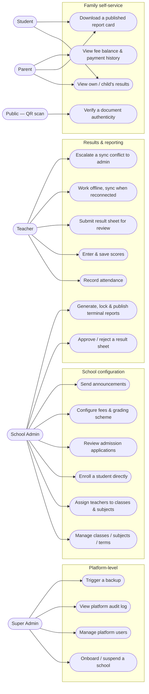

---

## 5. Data Flow Diagrams

### 5.1 Level 0 — Context

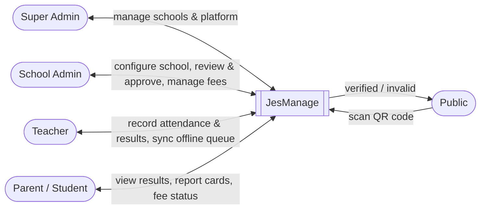

### 5.2 Level 1 — Major Processes

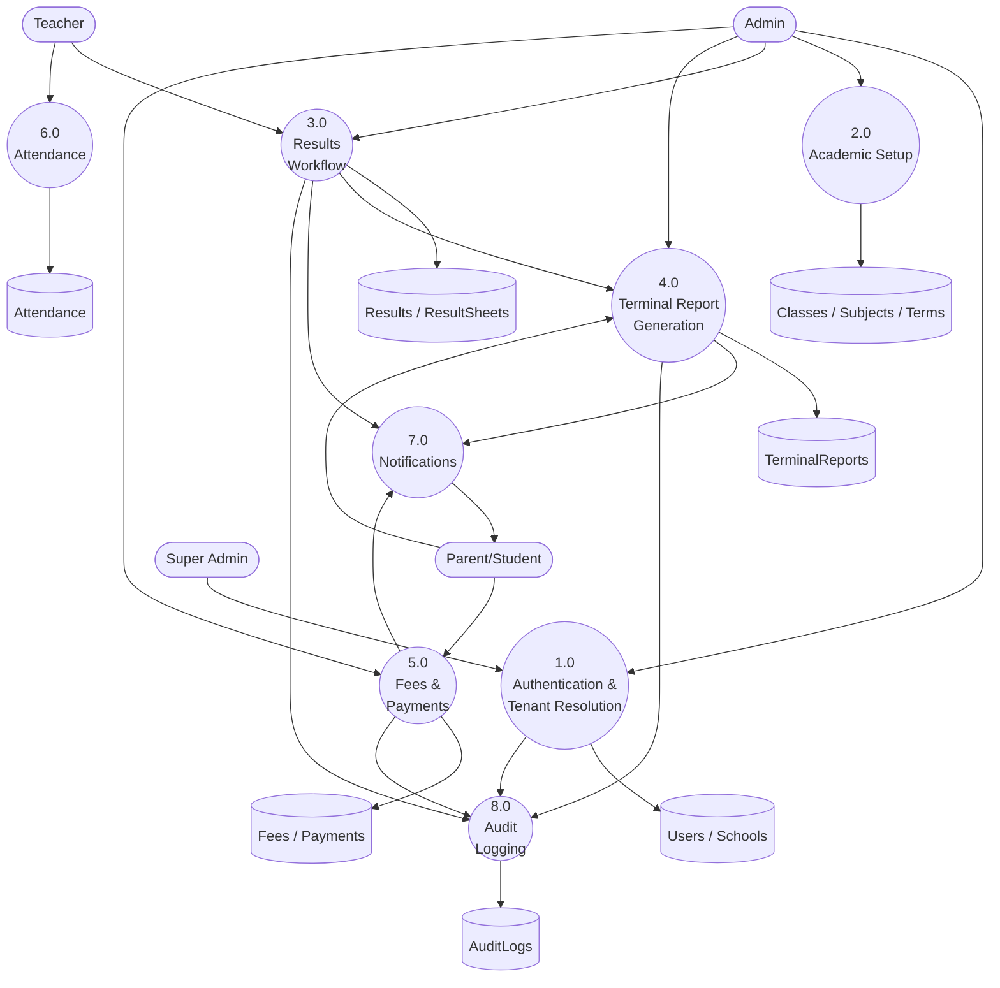

---

## 6. Sequence Diagrams

### 6.1 User login

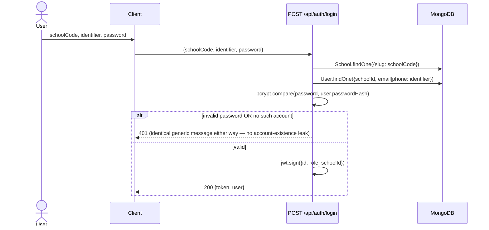

### 6.2 Super Admin onboards a new school

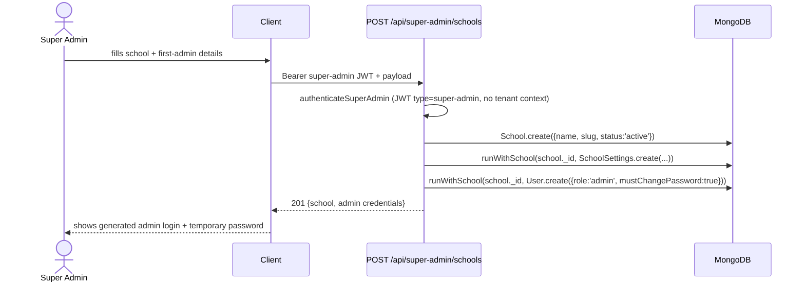

### 6.3 Teacher enters & saves results

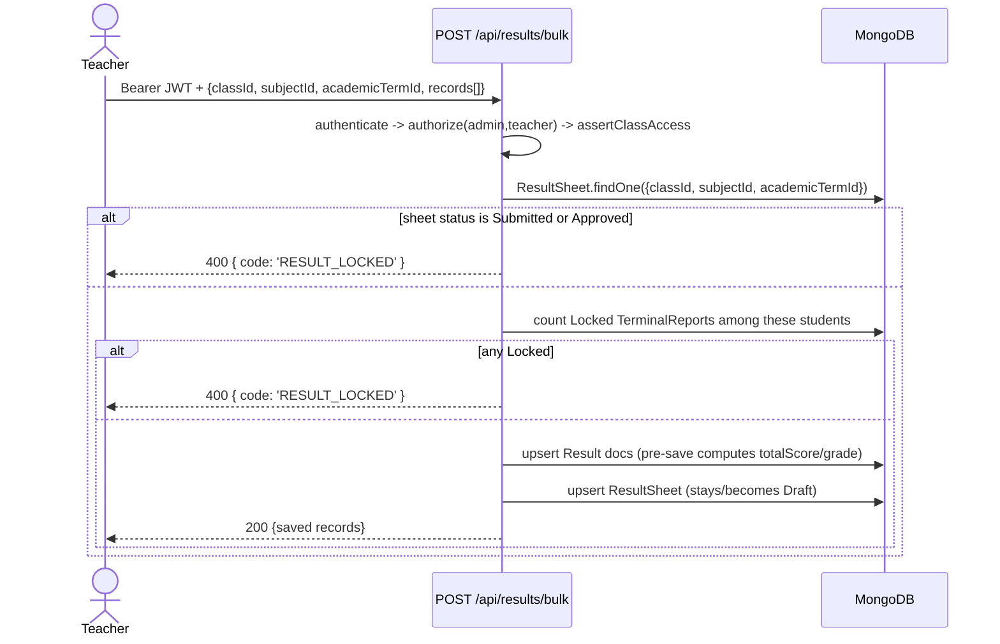

### 6.4 Teacher submits, admin approves

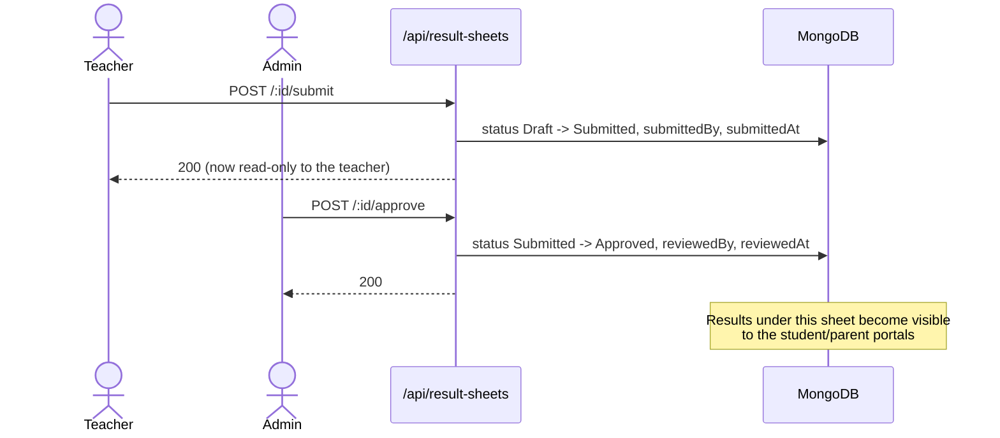

### 6.5 Admin generates, locks & publishes terminal reports

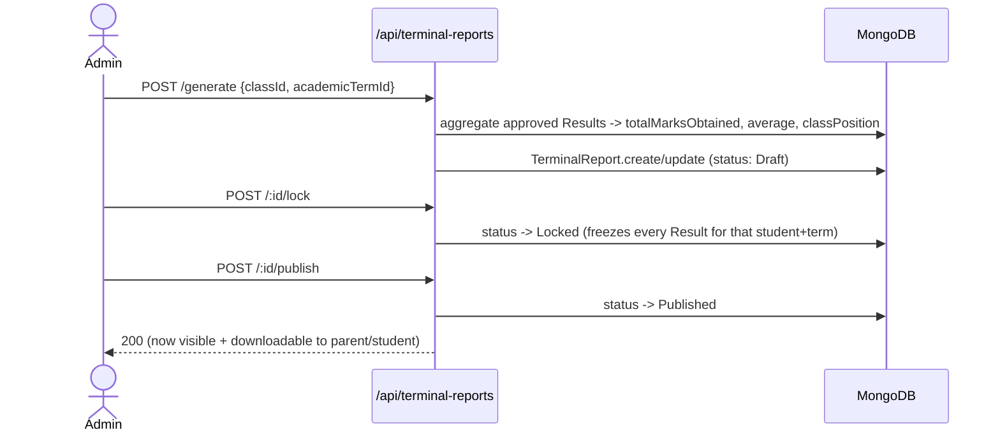

### 6.6 Parent downloads a report card

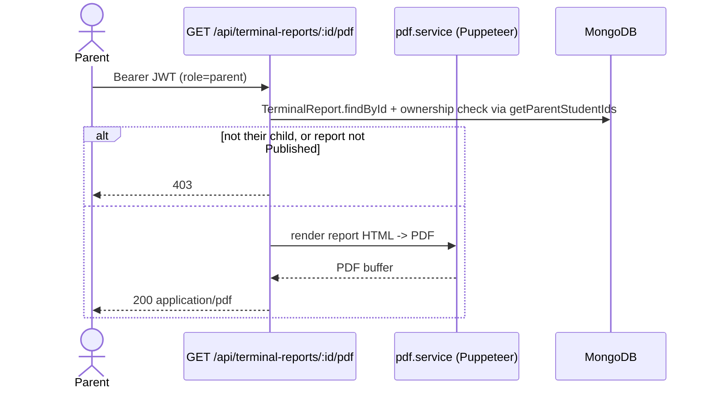

### 6.7 Offline sync — queued write flush

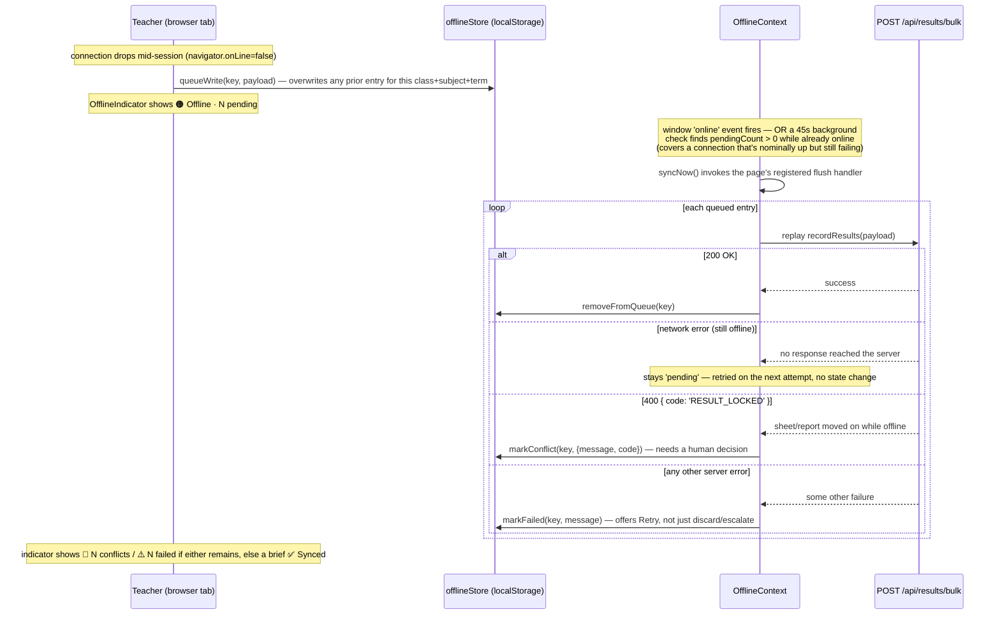

### 6.8 Offline conflict resolution

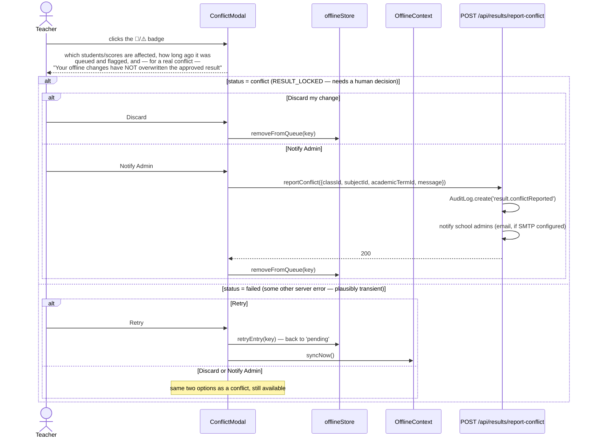

### 6.9 AI Remark Assistant (JesManage Intelligence, Phase 1)

The AI layer sits *behind* the same authorization chain as every other
write to a `TerminalReport`, not beside it — it has no standing database
access and never receives raw scores from the client. It only accepts a
`reportId`; every fact sent to the model is re-read from the database
under the requester's own tenant/role/class-assignment checks, the same
`assertClassAccess` boundary `terminalReports.controller.js` already
enforces for editing that same report.

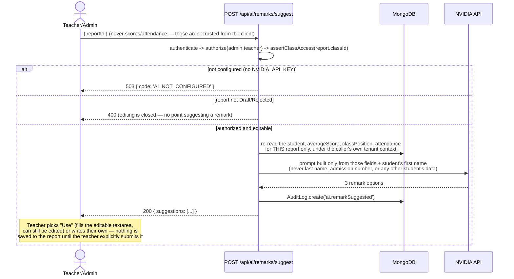

### 6.10 Academic Anomaly Detection (JesManage Intelligence, Phase 2)

Deliberately a separate endpoint from the roster a teacher edits — the
computation (re-reading a student's history in this subject, across terms)
only runs when an admin actually opens the review screen, not on every
keystroke-adjacent roster load during live entry. The deterministic flags
are the whole feature; the AI summary is a one-sentence enrichment on top,
skipped outright — not degraded — when no key is configured.

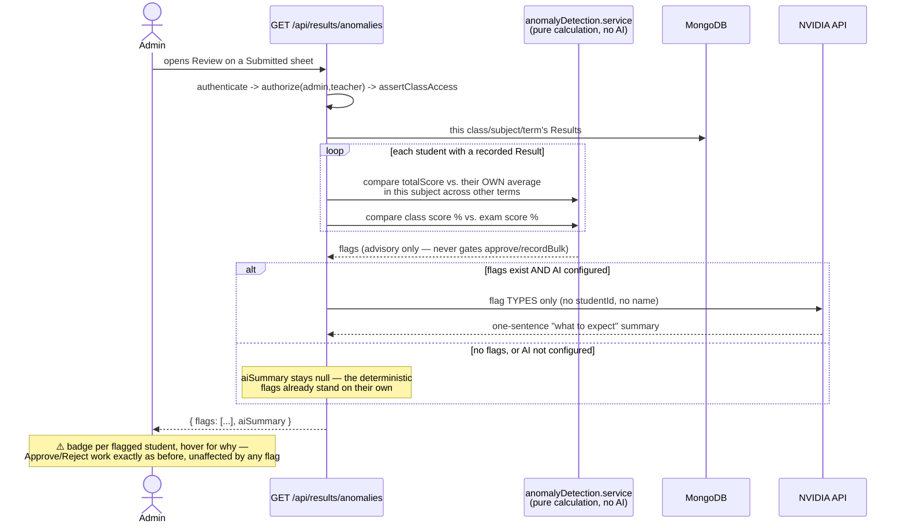

### 6.11 Student Performance Insights (JesManage Intelligence, Phase 3)

Built from exactly the same approved-results history `GET /results/student/:id`
already returns to the Student Profile and My Results pages — this endpoint
just summarizes it. Ownership is enforced by `assertStudentAccess`, a helper
factored out of `getForStudent` specifically so both actions share one
authorization boundary rather than maintaining two copies of the same check.

```mermaid
sequenceDiagram
    actor U as Student/Parent/Teacher/Admin
    participant API as GET /api/results/insights/:studentId
    participant Calc as performanceInsights.service<br/>(pure calculation, no AI)
    participant DB as MongoDB
    participant AI as NVIDIA API

    U->>API: opens Student Profile / My Results
    API->>API: authenticate -> assertStudentAccess<br/>(self / linked parent / assigned teacher / admin)
    API->>DB: this student's full Result history,<br/>filtered to Approved-only for student/parent
    API->>Calc: group by term (needs academicTerm.startDate to order) -><br/>trend vs. previous term; rank latest term's subjects
    Calc-->>API: trend + strongest/needs-attention subjects
    alt any data AND AI configured
        API->>AI: first name + trend direction/magnitude +<br/>subject NAMES only (never a score history)
        AI-->>API: 2-3 sentence narrative
    else no data yet, or AI not configured
        Note over API: aiNarrative stays null — panel simply<br/>doesn't render if there's nothing to show
    end
    API-->>U: { trend, strongestSubjects, needsAttentionSubjects, aiNarrative }
```

### 6.12 Early-Warning Intelligence (JesManage Intelligence, Phase 4)

The most consequential of the four Intelligence features — it correlates
attendance, multi-term academic trend (reusing 6.11's own trend engine per
student), and current-term subject performance into a single advisory
list. **Fee arrears are deliberately excluded as a flag type**: a family
owing money says nothing about a specific child's academic risk, and
scoring debt as "risk" would effectively flag poverty. Balance is attached
only as context on a student already flagged for a real academic or
attendance reason — never a path onto the list by itself (verified
directly in `tests/earlyWarning.test.js`: a student with debt and nothing
else never appears).

```mermaid
sequenceDiagram
    actor U as Admin/Teacher
    participant API as GET /api/early-warning/at-risk-students
    participant EW as earlyWarning.service<br/>(pure calculation, no AI)
    participant PI as performanceInsights.service<br/>(reused trend engine)
    participant Fees as fees.service<br/>(existing balance calculator)
    participant DB as MongoDB
    participant AI as NVIDIA API

    U->>API: opens Admin or Teacher Dashboard
    API->>API: authenticate -> authorize(admin,teacher)
    Note over API: admin -> every active student in the school<br/>teacher -> only students in their own assigned classes
    loop each candidate student
        API->>EW: detectRiskFlags(studentId, academicTermId, scheme)
        EW->>DB: this term's Attendance -> % attended (min. 5 records)
        EW->>PI: this student's full Result history -> trend.direction
        EW->>DB: this term's Results -> count of subjects below 40%
        EW-->>API: 0-3 flags (empty = not on the list at all)
    end
    loop each FLAGGED student only
        API->>Fees: getOutstandingBalanceForStudentTerm (existing, reused)
        Fees-->>API: balance (context only, never a flag source)
    end
    alt any students flagged AND AI configured
        API->>AI: first names + flag TYPES + fee PRESENCE (never an<br/>amount) + hard rules: never diagnose, never suggest<br/>discipline, never blame fees for academic flags
        AI-->>API: one supportive paragraph
    else nothing flagged, or AI not configured
        Note over API: aiSynthesis stays null
    end
    API-->>U: { students: [...flagged only], aiSynthesis }
    Note over U: Advisory only — nothing here blocks or<br/>automatically triggers any action elsewhere in the app
```

### 6.13 Natural-Language Admin Assistant (JesManage Intelligence, Phase 5)

The most injection-sensitive of the five Intelligence features, so the
architecture deliberately keeps the AI a long way from the database. The
model has exactly two jobs, both constrained: (1) classify a question into
one of a **small, fixed intent enum** and extract a handful of **typed,
individually allowlisted** parameters — it never writes or sees a database
query — and (2) paraphrase an *already-computed, already-authorized* result
set into English. Every actual data fetch in between is an ordinary,
already tenant-scoped Mongoose query, identical in kind to every other
query in this codebase. A hint the model invents (a wrong class name, a
smuggled extra field) can only ever resolve to "not found" or be silently
dropped — it can never become a query of its own. Admin-only; there is no
teacher or Super-Admin path for this endpoint in this pass.

```mermaid
sequenceDiagram
    actor A as Admin
    participant API as POST /api/ai/query
    participant AI as NVIDIA API (call 1: classify)
    participant AQ as aiQuery.service<br/>(pure, tenant-scoped queries)
    participant DB as MongoDB
    participant AI2 as NVIDIA API (call 2: phrase the answer)

    A->>API: { question: "free text" }
    API->>API: authenticate -> authorize(admin only)
    API->>AI: classify into ONE of a fixed intent enum +<br/>typed params (never a query)
    AI-->>API: { intent, params } — raw response
    API->>API: validate intent against the enum, allowlist<br/>every param field individually -> unknown/malformed<br/>input silently degrades to "unsupported", never passed through
    alt intent = unsupported
        API-->>A: a plain "I can only answer X/Y/Z" message
    else a supported intent
        API->>AQ: resolve any class/term HINT to a real id<br/>(ordinary tenant-scoped lookup — never trusts the hint as an id)
        AQ->>DB: run the matching pre-built query template<br/>(fee arrears / subject averages / at-risk students)
        DB-->>API: rows — this school's data only, by construction
        API->>AI2: question + the ALREADY-COMPUTED rows only<br/>(paraphrase, never re-derive or add facts)
        AI2-->>API: one short plain-English answer
        API->>DB: AuditLog.create('ai.adminQuery')
        API-->>A: { answer, rows, intent } — rows are always the<br/>real, untruncated data regardless of what the summary says
    end
```

### 6.14 Mark Entry Status Matrix (Stage 7 — not a JesManage Intelligence feature; no AI involved)

A whole-school Classes × Subjects overview, admin-only, read-only by
design: unlike `resultSheets.controller.js`'s own `list()` (which lazily
creates a Draft `ResultSheet` the first time a single class/subject/term is
viewed — fine for one class), the matrix would otherwise write an empty
document for every class-subject pair in the school just from an admin
glancing at the overview. It never creates anything; a pair with no
`ResultSheet` yet is reported as `not_started` (or `draft` if `Result`
documents already exist but nobody has opened the review tab) without
persisting it.

```mermaid
sequenceDiagram
    actor A as Admin
    participant API as GET /result-sheets/matrix
    participant DB as MongoDB

    A->>API: opens Results -> Status Matrix (optional academicTermId)
    API->>API: authenticate -> authorize(admin only)
    API->>DB: every Class in the school
    API->>DB: every ClassSubject for those classes -> the actual (class, subject) pairs to render
    API->>DB: every ResultSheet for those classes + this term (one query, not per-pair)
    API->>DB: every Result for those classes + this term (one query, not per-pair)
    API->>API: for each pair: ResultSheet.status if one exists,<br/>else 'draft' if Results exist, else 'not_started'
    API-->>A: { classes, subjects, cells } — nothing written to the database
```

### 6.15 Batch Student ID Card Generator (Stage 7 — no AI involved)

Deliberately built by extending the *existing* PDF and QR-verification
infrastructure rather than creating parallel systems: `renderHtmlToPdfBuffer`
(already used for report cards) renders the sheet, and
`buildVerificationQrDataUrl(type, id, schoolSlug)` — already generic on
`type`, previously used only for `'receipt'` and `'report'` — gets a third
value, `'student'`, rather than a bespoke QR/lookup mechanism of its own.
The public verify page (`client/src/pages/verify/VerifyDocument.jsx`)
already branches on `data.type`, so it only needed one more branch, not a
new page.

```mermaid
sequenceDiagram
    actor A as Admin
    participant API as GET /students/id-cards/pdf?classId=
    participant DB as MongoDB
    participant QR as verification.service (existing, reused)
    participant PDF as pdf.service (existing, reused)
    participant Pub as Public visitor (scans a printed card)
    participant VAPI as GET /verify/student/:schoolSlug/:id

    A->>API: selects one class, clicks "Print ID Cards"
    API->>API: authenticate -> authorize(admin only)
    API->>DB: every active Student in that class
    API->>QR: buildVerificationQrDataUrl('student', studentId, schoolSlug)<br/>— one per student, same helper report cards already use
    API->>PDF: idCardTemplate.service builds the A4 HTML<br/>(10 cards/page, photoUrl or an SVG placeholder if none)
    PDF-->>API: PDF buffer
    API->>DB: AuditLog.create('student.idCardsDownload')
    API-->>A: application/pdf download

    Note over Pub,VAPI: Later — anyone can scan the printed QR code, no login
    Pub->>VAPI: opens /verify/student/:schoolSlug/:id
    VAPI->>DB: School.findOne({slug}) -> runWithSchool -> Student.findById<br/>(same tenant-scoped, public-safe pattern as receipt/report verification)
    VAPI-->>Pub: { valid, studentName, admissionNo, className, status }<br/>— a real ID resolves even if the student is now archived/inactive,<br/>reported as such rather than a bare "not found"
```

### 6.16 WAEC/BECE Candidate Data Export (Stage 7 — no AI involved)

CSV only — no Excel-writing library exists anywhere in this project, and
adding one for a single export wasn't a decision to make silently.
Validation runs as a genuinely separate, blocking pre-flight step: the
export endpoint re-checks it independently rather than trusting that the
client already called preview, so a request straight at `/waec-export`
with incomplete data still fails closed with a clear reason, never a
partial CSV.

```mermaid
sequenceDiagram
    actor A as Admin
    participant API1 as GET /students/waec-preview?classId=
    participant API2 as GET /students/waec-export?classId=
    participant Val as waecExport.service<br/>(pure validation + CSV building)
    participant DB as MongoDB

    A->>API1: selects a class, clicks "WAEC Export"
    API1->>DB: active Students in that class
    API1->>Val: validateCandidates() -> per-student list of<br/>missing mandatory fields (DOB, index no., photo, gender)
    alt any candidate incomplete
        API1-->>A: { ready:false, issues:[...] } — UI shows who's missing what,<br/>with a link straight to each student's profile to fix it
    else every candidate complete
        API1-->>A: { ready:true }
        A->>API2: (client proceeds to the real download)
        API2->>DB: active Students again + this class's ClassSubject -> Subject.code
        API2->>Val: validateCandidates() AGAIN — independently, not trusting<br/>that the preview call actually ran or that nothing changed since
        Val-->>API2: still clean
        API2->>DB: AuditLog.create('waec.exported')
        API2-->>A: text/csv download — INDEX_NUMBER, SURNAME, FIRST_NAME,<br/>OTHER_NAMES (always blank — no such field exists), GENDER,<br/>DATE_OF_BIRTH, BECE_SUBJECT_CODES (shared across the whole class)
    end
```

---

## 7. Verification

This document's diagrams are traceable to source:
- Middleware chain: `server/src/app.js`, `server/src/middleware/*.js`
- Tenant scoping: `server/src/plugins/tenantScope.js`,
  `server/src/middleware/tenantContext.js`
- Models/ERD: `server/src/models/*.js`
- Route tables: `server/src/routes/*.js`, `server/src/superAdmin/routes.js`
- Results/terminal-report lifecycle: `server/src/controllers/results.controller.js`,
  `server/src/controllers/resultSheets.controller.js`,
  `server/src/controllers/terminalReports.controller.js`
- Offline sync: `client/src/utils/offlineStore.js`,
  `client/src/context/OfflineContext.jsx`,
  `client/src/components/common/ConflictModal.jsx`
- AI Remark Assistant: `server/src/services/ai.service.js`,
  `server/src/controllers/ai.controller.js`,
  `client/src/pages/results/TerminalReports.jsx`
- Academic Anomaly Detection: `server/src/services/anomalyDetection.service.js`,
  `server/src/controllers/results.controller.js` (`getAnomalies`),
  `client/src/pages/results/TerminalReports.jsx` (`ReviewSheetModal`)
- Student Performance Insights: `server/src/services/performanceInsights.service.js`,
  `server/src/controllers/results.controller.js` (`getInsights`, `assertStudentAccess`),
  `client/src/components/results/PerformanceInsightsPanel.jsx`
- Early-Warning Intelligence: `server/src/services/earlyWarning.service.js`,
  `server/src/controllers/earlyWarning.controller.js`,
  `client/src/pages/dashboard/Dashboard.jsx` (`AtRiskStudentsPanel`)
- Natural-Language Admin Assistant: `server/src/services/aiQuery.service.js`,
  `server/src/controllers/aiQuery.controller.js`,
  `client/src/components/common/AskJesManage.jsx`
- Mark Entry Status Matrix: `server/src/controllers/resultSheets.controller.js`
  (`getMatrix`), `client/src/pages/results/MarkEntryMatrix.jsx`
- Student photo upload / WAEC index number: `server/src/models/student.model.js`,
  `server/src/middleware/upload.js` (`uploadStudentPhoto`),
  `server/src/controllers/students.controller.js` (`uploadPhoto`)
- Batch Student ID Card Generator: `server/src/services/idCardTemplate.service.js`,
  `server/src/controllers/students.controller.js` (`downloadIdCardsPdf`),
  `server/src/controllers/verify.controller.js` (`verifyStudent`),
  `client/src/pages/students/StudentList.jsx`
- WAEC/BECE Candidate Data Export: `server/src/services/waecExport.service.js`,
  `server/src/controllers/students.controller.js`
  (`previewWaecExport`, `downloadWaecExport`)

Behavioral correctness of the flows described above (not just their shape) is
covered by the automated test suite — `server/tests/` (101/101 passing):
`auth.test.js`, `tenancy.test.js`, `authorization.test.js`, `results.test.js`,
`portals.test.js`, `offline.test.js`, `ai.test.js`, `anomalies.test.js`,
`insights.test.js`, `earlyWarning.test.js`, `aiQuery.test.js`,
`resultSheetsMatrix.test.js`, `studentProfile.test.js`, `idCards.test.js`,
`waecExport.test.js`.

This closes Stage 6 (JesManage Intelligence) — all five planned features
(§6.9-§6.13) are built, gated behind an optional `NVIDIA_API_KEY`, and
tested. §6.14-§6.16 close out Stage 7's original three-item list — plain
reporting/printing/export features, no AI involved.
